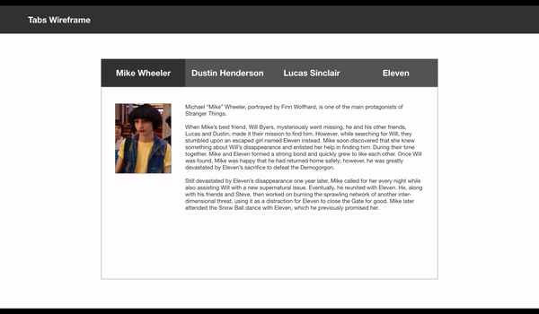
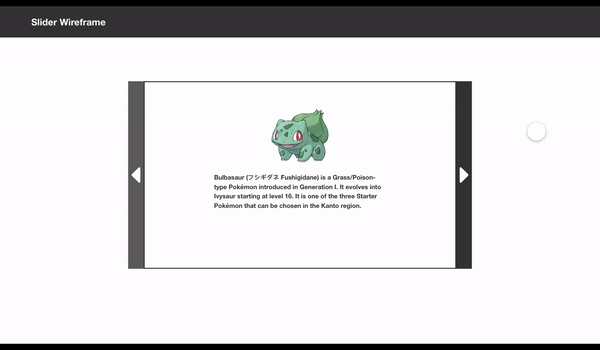
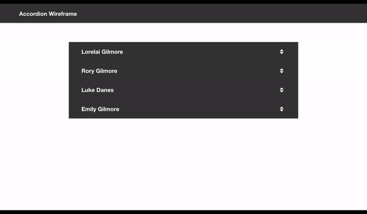
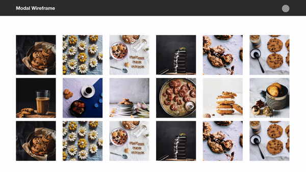

# UI Patterns

You will need to pick a UI pattern from the listed below then build out the UI pattern.

You must build your UI pattern from scratch (CSS, HTML, and javascript) and no UI kits/frameworks (like bootstrap, Material Design, etc.).

####  Tabs (Module)

**Summary:** A **module tab** is a User Interface (UI) design pattern where content is separated into different panes, and each pane is viewable one at a time. The user requests content to be displayed by clicking (or in some instances hovering over) the content’s corresponding tab control.

resource: [Smashing Magazine definition](https://www.smashingmagazine.com/2009/06/module-tabs-in-web-design-best-practices-and-solutions/#:~:text=A%20module%20tab%20is%20a%20User%20Interface%20(UI)%20design%20pattern,the%20content's%20corresponding%20tab%20control.)

#### Slideshow/Carosel

**Summary:** **Carousels** allow multiple pieces of content to occupy a single, coveted space. This may placate corporate infighting, but on large or small viewports, people often scroll past carousels. A static hero or integrating content in the UI may be better solutions. 

resource: [nngroup definition](https://www.nngroup.com/articles/designing-effective-carousels/#:~:text=Summary%3A%20Carousels%20allow%20multiple%20pieces,UI%20may%20be%20better%20solutions.)

#### Accordion

**Summary:** An **accordion** is a design element that expands in place to expose some hidden information. Unlike overlays, accordions push the page content down instead of being superposed on top of page content.

resource: [nngroup definition](https://www.nngroup.com/articles/mobile-accordions/)

#### Modal

When an element is clicked on, usually an image, button or link, another element on a page that was hidden is now visible for the user to view.

**Summary:** A **modal dialog** is a dialog that appears on top of the main content and moves the system into a special mode requiring user interaction. This dialog disables the main content until the user explicitly interacts with the modal dialog.

resource: [nngroup definition](https://www.nngroup.com/articles/modal-nonmodal-dialog/)

